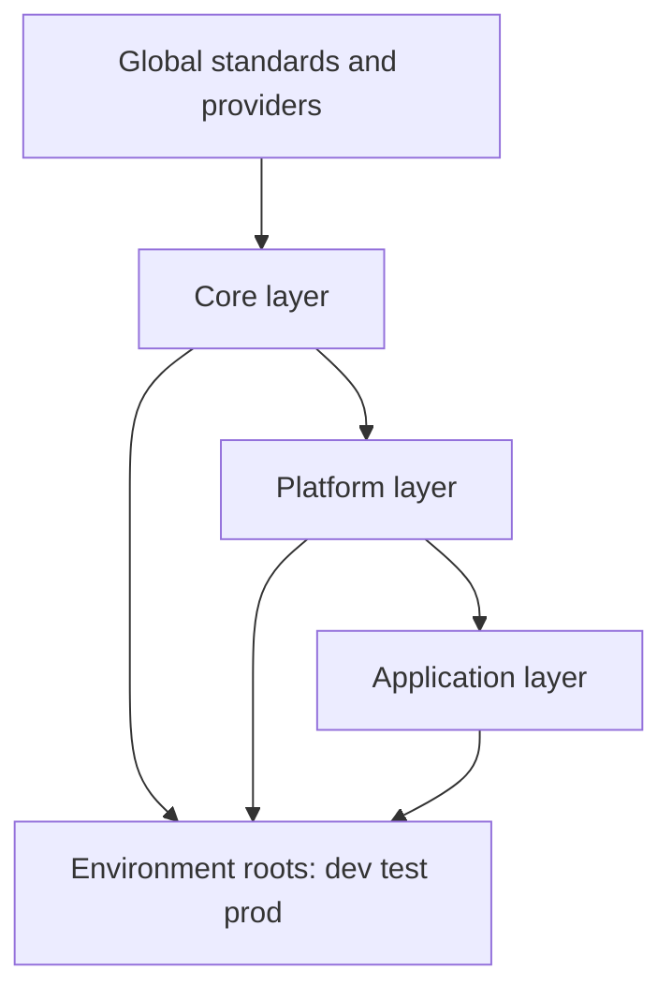
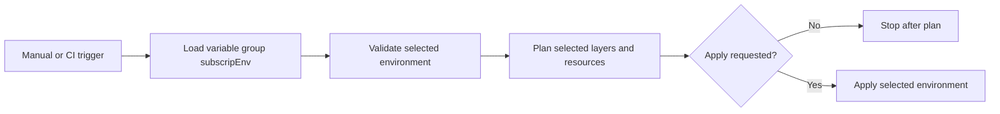

# Enterprise Azure Terraform Repository

This repository is an Azure DevOps-ready Terraform foundation for Azure deployments with enterprise layering, reusable modules, environment roots, Key Vault-backed variable group usage, and a selectable deployment pipeline.

## Goals

- Organize Terraform into **core**, **platform**, and **application** layers.
- Keep providers, versions, naming, and shared metadata global.
- Support `dev`, `test`, and `prod` root configurations.
- Integrate Azure DevOps variable group `subscripEnv` for secret-driven authentication and runtime values.
- Enable stage, environment, and resource selection in the pipeline.

## Repository map

```text
azure-tf-repo/
├── azure-pipelines.yml
├── README.md
├── .gitignore
├── global/
│   ├── versions.tf
│   ├── providers.tf
│   ├── backend.hcl.example
│   ├── naming.tf
│   └── standards.md
├── catalog/
│   └── resource-selection.md
├── layers/
│   ├── core/
│   │   └── modules/
│   │       ├── resource_group/
│   │       ├── virtual_network/
│   │       ├── storage_account/
│   │       ├── key_vault/
│   │       └── log_analytics_workspace/
│   ├── platform/
│   │   └── modules/
│   │       ├── application_insights/
│   │       ├── app_service_plan/
│   │       ├── container_registry/
│   │       ├── data_factory/
│   │       ├── logic_app/
│   │       ├── machine_learning_service/
│   │       ├── machine_learning_compute_cluster/
│   │       ├── machine_learning_compute_instance/
│   │       └── synapse/
│   └── application/
│       └── modules/
│           ├── app_service/
│           ├── container_app/
│           └── cognitive_services/
├── environments/
│   ├── dev/
│   ├── test/
│   └── prod/
└── pipelines/
    ├── templates/
    │   ├── terraform-validate.yml
    │   ├── terraform-plan.yml
    │   ├── terraform-apply.yml
    │   └── terraform-common-steps.yml
    └── scripts/
        └── terraform_install.sh
```

## Layer diagram



## Pipeline diagram



## Variable group and secrets

The pipeline consumes Azure DevOps variable group `subscripEnv`.
The expected secret or variable names are:

- `spID`
- `spSecret`
- `tenantId`
- `subscriptionId`
- `devops-scrg-ID`

These are mapped into Terraform and Azure CLI authentication during pipeline execution.

## Selectable pipeline behavior

The pipeline supports choosing:

- target environment: `dev`, `test`, or `prod`
- action: `validate`, `plan`, or `apply`
- layer scope: `all`, `core`, `platform`, or `application`
- resource deployment selectors through booleans and resource catalog variables

## Resource selection model

Environment roots use booleans such as `deploy_core`, `deploy_platform`, `deploy_application`, and per-resource toggles so that a specific environment can deploy only what is required.

Examples:

- `dev` can deploy only core plus app service.
- `test` can deploy core, platform, and selected data services.
- `prod` can deploy the complete estate.

## Azure DevOps recommendations

- Link `subscripEnv` to Azure Key Vault where possible.
- Add approval checks on Azure DevOps environments for `test` and `prod`.
- Keep backend files outside source control or store them as secure files.
- Use the service connection identifier from `devops-scrg-ID` as the default service connection reference.
